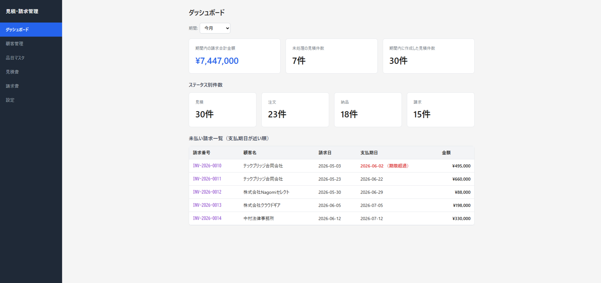
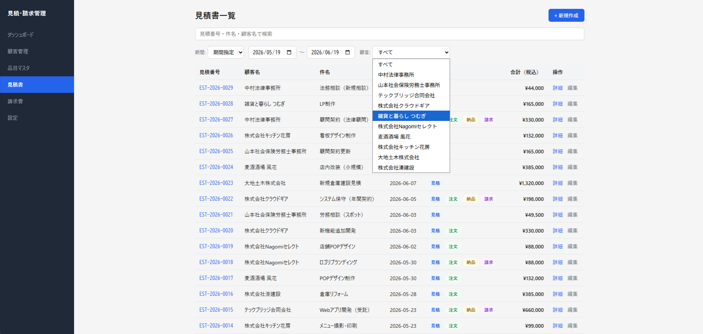
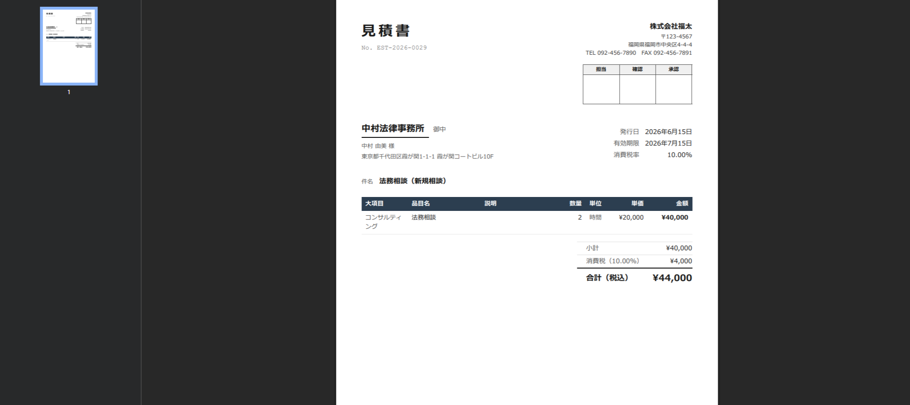

[](https://estimate-invoice-frontend.onrender.com)

# 見積・請求書管理アプリ

個人事業主向けの見積・請求書管理アプリ。見積書作成 → 請求書発行 → 入金管理までを一元化。

## 🌐 デモ

公開URL: https://estimate-invoice-frontend.onrender.com

※無料プランのため、しばらくアクセスがないとサーバーがスリープし、初回アクセス時は起動に時間がかかる場合があります。

## 📸 スクリーンショット

**ダッシュボード**


**見積書一覧**


**PDF出力結果**


## 主な機能

- 顧客管理、品目マスタ（大項目・小項目・単価）
- 見積書作成・ステータス管理（見積→注文→納品→請求の進行管理）
- 請求書発行（見積からの項目引き継ぎ）
- 入金管理（未払い／入金済みのステータス管理、支払期日アラート）
- 日付・顧客での絞り込み検索
- PDF出力・印刷・印鑑欄（日本語フォント対応）

## 技術スタック

| 区分 | 技術 |
|------|------|
| フロントエンド | React, React Router, Vite |
| バックエンド | Node.js (Express) |
| データベース | PostgreSQL (Neon) |
| PDF出力 | Puppeteer / puppeteer-core |
| デプロイ | Render（フロント: Static Site / バック: Web Service） |

## システム構成

```
[ブラウザ]
   │  fetch (VITE_API_BASE_URL)
   ▼
[React (Vite) - Render Static Site]
   │  REST API (/api/...)
   ▼
[Express API - Render Web Service]
   │              │
   │ pg(SSL)      │ puppeteer-core (Chrome)
   ▼              ▼
[Neon PostgreSQL] [PDF出力 (見積書/請求書)]
```

## フォルダ構成

```
estimate-invoice-app/
├── client/                         # React フロントエンド
│   ├── public/                     # 静的ファイル（favicon 等）
│   └── src/
│       ├── components/
│       │   ├── common/             # ボタン・テーブル・フォーム部品など
│       │   └── layout/             # ヘッダー・サイドバー・ページ枠
│       ├── pages/
│       │   ├── customers/          # 顧客管理
│       │   ├── items/              # 品目マスタ
│       │   ├── estimates/          # 見積書
│       │   └── invoices/           # 請求書
│       └── services/               # API通信（ベースURLは環境変数で切替）
├── server/                         # Express バックエンド
│   ├── assets/fonts/               # PDF埋め込み用日本語フォント
│   ├── render-build.sh             # Render用ビルドスクリプト（Chromeインストール）
│   └── src/
│       ├── config/                 # DB接続・環境変数
│       ├── controllers/            # リクエスト処理
│       ├── routes/                 # APIルート定義
│       ├── templates/              # PDF用HTMLテンプレート
│       └── utils/                  # 共通ユーティリティ（PDF生成など）
└── database/
    ├── migrations/                 # スキーマ変更履歴
    └── schema.sql                  # テーブル定義
```

## 工夫した点・技術的チャレンジ

### セキュリティ

元ネットワークエンジニアとしての経験から、「外部に何を渡し、何を渡さないか」の境界を意識して設計。

- DB接続情報（`DATABASE_URL`）やフロントのAPI参照先（`VITE_API_BASE_URL`）はコードに直書きせず、すべて環境変数経由で注入。`.env`はリポジトリにコミットせず`.env.example`のみを共有する構成。
- Neon（サーバーレスPostgres）への接続はSSL必須（`ssl: { rejectUnauthorized: false }`）とし、平文接続を許可しない。
- 全SQLクエリは`pg`のプレースホルダ（`$1`, `$2`...）によるパラメータバインドで統一し、文字列結合によるSQLインジェクションの経路を作らない。
- PDF生成用HTMLテンプレートでは、顧客名・品目名など外部入力をすべて`esc()`関数でHTMLエスケープしてから埋め込み、XSS（PDF内へのスクリプト注入）を防止（[server/src/templates/documentTemplate.js](server/src/templates/documentTemplate.js)）。
- 現在のCORS設定はローカル開発用デフォルト値を持つが、本番では環境変数`CORS_ORIGIN`で許可オリジンを明示的に絞る構成。

### 例外処理・エラーハンドリング

- DB接続エラーは握りつぶさず、`console.error`で原因が追えるレベルまで詳細化。Node 18+環境固有の`AggregateError`（DNS解決失敗時に`.message`が空文字になる）に対応する専用のエラー整形処理を実装（[server/src/config/database.js](server/src/config/database.js)）。
- PDF生成（Puppeteer起動・ページレンダリング）の失敗時も、実行パスの存在チェック結果やエラースタックを全てログに出し、本番環境でのデバッグ可能性を確保。

### MySQL→PostgreSQL移行

開発初期はMySQL(mysql2)前提で実装していたが、Neon（PostgreSQL）へ移行。

- プレースホルダを`?`から`$1, $2...`の番号付きに全面置換（動的WHERE句の組み立てロジックも合わせて修正）。
- 検索条件の大文字小文字区別の違いに対応するため`LIKE`を`ILIKE`へ変更。
- MySQLの`SUBSTRING_INDEX`をPostgreSQLの`split_part`に置き換え（見積/請求番号の連番生成ロジック）。
- `BIGINT`列がpgではデフォルトで文字列として返る挙動の違いを吸収するため、`pg.types.setTypeParser`でIDをJS numberにパースし、フロントエンド既存コードへの影響を最小化。

### Puppeteerの本番デプロイ

Render無料プラン（ビルド環境と実行環境が分離されたネイティブランタイム、root権限なし）特有の制約に段階的に対応した。

- **Chromeバイナリの確保**: `puppeteer-core`単体にはブラウザダウンロード機能がないため、`puppeteer`本体をdevDependenciesに追加し、ビルドスクリプトで`npx puppeteer browsers install chrome`を実行する方式を採用。
- **実行パスのズレ**: 固定の`PUPPETEER_EXECUTABLE_PATH`はビルドごとにバージョン番号を含むパスが変わり壊れやすいため、`@puppeteer/browsers`のCache APIで実行時に動的にインストール済みChromeを検出する方式へ変更。
- **ビルド/実行環境の分離**: Renderのネイティブランタイムは`/opt/render/.cache`配下がビルド時のみ有効で実行時には引き継がれないという制約があり、Chromeのインストール先を`/opt/render/project/src`配下（リポジトリのチェックアウト先、ビルド・実行で共有される唯一の永続領域）に変更して解決。
- **日本語フォントの欠落**: RenderのLinux環境に日本語フォントが入っておらず、PDF内の漢字が欠落する問題が発生。`apt-get`が使えない（root権限なし）制約下で、Noto Sans JPフォントファイルをリポジトリに同梱し、HTML側で`@font-face`によりbase64データURIとして直接埋め込むことで、OSのフォント設定（fontconfig）に一切依存しない構成にした。

## セットアップ（ローカル開発）

### 前提

- Node.js 18以上
- PostgreSQLデータベース（Neonなどのクラウド、またはローカルPostgres）

### バックエンド

```bash
cd server
npm install
cp .env.example .env   # DATABASE_URL等を編集
npm run dev             # http://localhost:3001
```

初回はスキーマとマイグレーションを投入してください（`database/schema.sql`、`database/migrations/`配下）。サンプルデータ投入は`server/scripts/seedSampleData.js`を利用できます。

### フロントエンド

```bash
cd client
npm install
npm run dev              # http://localhost:5173
```

ローカル開発時は`client/.env.development`の`VITE_API_BASE_URL=http://localhost:3001`がそのまま使われます。

### 本番ビルド構成（参考）

- フロントエンド: Render Static Site（環境変数`VITE_API_BASE_URL`にバックエンドURLを設定）
- バックエンド: Render Web Service（Root Directory: `server`、Build Command: `bash render-build.sh`、環境変数`DATABASE_URL` / `PUPPETEER_CACHE_DIR` / `CORS_ORIGIN`を設定）

## 📝 今後の課題

- [ ] API層の自動テスト導入（Jest + Supertest）
- [ ] レスポンシブデザイン対応（現在はPC向けのみ）
- [ ] JWT認証によるマルチユーザー対応
- [ ] Googleログイン対応

## 設計上の注意点

- 本アプリはシングルユーザー（個人事業主1名）による運用を想定した設計です。
- 認証・認可機能は今回のスコープ外としています。マルチユーザー対応が必要な場合はJWT認証の追加実装で対応可能です。
- 本アプリはPC利用を想定したUI設計です。見積・請求書管理という業務特性上、デスクトップでの利用を主眼に置いています。スマートフォン・タブレット向けのレスポンシブ対応は今回のスコープ外としています。
