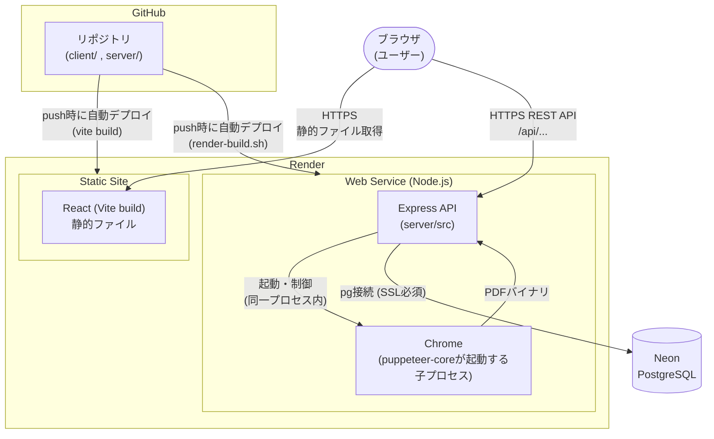
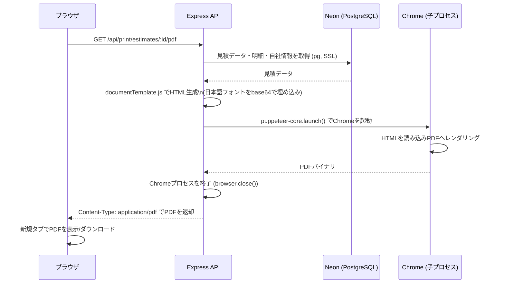

# システム構成

本ドキュメントは、機能やデータ構造ではなく「コンポーネント間の通信経路とデータの流れ」に焦点を当てた技術ドキュメント。機能一覧は[README](../README.md)、テーブル設計は[docs/database/DESIGN.md](./database/DESIGN.md)を参照。

## 全体構成図

## 各コンポーネントの役割

| コンポーネント | 役割 |
|---|---|
| **ブラウザ** | Reactアプリの実行環境。画面操作、APIへのfetch呼び出し、PDFの表示・ダウンロードを担う |
| **React (Vite) — Render Static Site** | ビルド済みの静的ファイル（HTML/JS/CSS）をホスティングするだけで、サーバーサイド処理は行わない。APIの呼び出し先は環境変数`VITE_API_BASE_URL`としてビルド時に埋め込まれる |
| **Express API — Render Web Service** | REST APIの提供、ビジネスロジック（見積→請求の引き継ぎ、ステータス管理など）、DBアクセス、PDF生成の起点。常時起動するNode.jsプロセス |
| **Chrome（Puppeteer経由の子プロセス）** | 独立したサービスではなく、Express APIプロセスが`puppeteer-core`経由でその場で起動するヘッドレスブラウザ。HTMLをPDFに変換するためだけに使われ、リクエスト処理が終わると終了する |
| **Neon (PostgreSQL)** | 永続データの保存先。サーバーレスPostgresで、Express APIから`pg`ライブラリ経由でSSL接続する |

## リクエストフロー例：見積書PDF出力

ユーザーが見積書詳細画面で「PDF出力」ボタンを押した場合のデータの流れ。

ポイント:
- DB問い合わせとPDFレンダリングは同じExpressプロセス内で順に行われる（別サービスへの非同期委譲はしていない）
- Chromeはリクエストごとに起動・終了する。常駐させていないため、メモリ消費を抑えつつ無料プランのリソース制約に収まるようにしている
- 生成したHTMLには顧客名・品目名などのエスケープ済みテキストと、フォントのbase64データが含まれており、外部ネットワークアクセスなしでPDF化が完結する

## デプロイ構成

### 自動デプロイの仕組み

GitHubリポジトリに対し、Renderの2つのサービス（Static Site / Web Service）がそれぞれ独立してWebhook連携している。`main`ブランチへのpushをトリガーに、各サービスが個別にビルド・デプロイを実行する。

| サービス | Root Directory | ビルド内容 |
|---|---|---|
| Static Site（フロントエンド） | `client` | `npm install` → `vite build` |
| Web Service（バックエンド） | `server` | `render-build.sh`（`npm install` → Chromeのインストール） |

2つのサービスはデプロイのタイミングが独立しているため、フロントエンドとバックエンドのAPIの互換性（破壊的変更を含むAPI変更時など）には注意が必要。

### 環境変数の管理

環境変数はRenderダッシュボードの各サービスの「Environment」で管理し、リポジトリには`.env.example`のみをコミットしている。

| サービス | 環境変数 | 役割・注意点 |
|---|---|---|
| Static Site | `VITE_API_BASE_URL` | バックエンドAPIのURL。**ビルド時に静的ファイルへ埋め込まれる**ため、値を変更した場合は再ビルド（再デプロイ）が必要 |
| Web Service | `DATABASE_URL` | Neonの接続文字列（SSL必須） |
| Web Service | `PUPPETEER_CACHE_DIR` | Chromeのインストール先。Renderのビルド/実行環境分離の制約を踏まえ、`/opt/render/project/src`配下（永続領域）を指定 |
| Web Service | `CORS_ORIGIN` | フロントエンドのオリジンを許可するためのCORS設定 |
| Web Service | `PORT` | Renderが自動的に注入する待受ポート |
