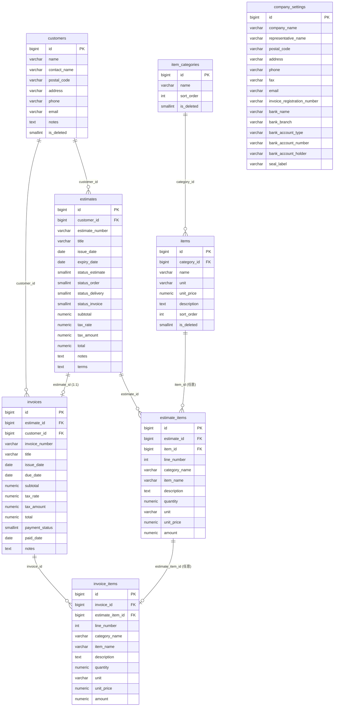

# DB設計書

## 概要

個人事業主向け見積・請求管理アプリのデータベース。顧客情報、品目マスタ、見積書、請求書、入金状況、自社情報（PDF出力用）を一元管理する。DBは PostgreSQL（Neon サーバーレスPostgres）。

業務フローは「見積書作成 → 受注確定 → 納品 → 請求書発行 → 入金」であり、このフローの進行状況をテーブル設計上でどう表現するかが本DBの中心的な設計テーマになっている。

## ER図



## テーブル一覧

| テーブル名 | 説明 |
|-----------|------|
| `customers` | 顧客（取引先） |
| `item_categories` | 品目マスタ：大項目 |
| `items` | 品目マスタ：小項目（大項目に紐づく） |
| `estimates` | 見積書ヘッダ |
| `estimate_items` | 見積明細 |
| `invoices` | 請求書ヘッダ |
| `invoice_items` | 請求明細 |
| `company_settings` | 自社情報（PDF・印鑑欄用、1レコード運用） |

全テーブル共通: `id`は`BIGINT GENERATED ALWAYS AS IDENTITY`（主キー）、`created_at`/`updated_at`は`TIMESTAMP NOT NULL DEFAULT CURRENT_TIMESTAMP`を持つ。`updated_at`は更新トリガーで自動更新される（後述）。

### customers（顧客）

| カラム | 型 | 制約 | 説明 |
|---|---|---|---|
| id | BIGINT | PK | |
| name | VARCHAR(255) | NOT NULL | 顧客名（会社名・屋号） |
| contact_name | VARCHAR(100) | | 担当者名 |
| postal_code | VARCHAR(10) | | 郵便番号 |
| address | VARCHAR(500) | | 住所 |
| phone | VARCHAR(20) | | 電話番号 |
| email | VARCHAR(255) | | メールアドレス |
| notes | TEXT | | 備考 |
| is_deleted | SMALLINT | NOT NULL DEFAULT 0 | 論理削除フラグ |
| created_at / updated_at | TIMESTAMP | NOT NULL | |

インデックス: `idx_customers_name`, `idx_customers_is_deleted`

### item_categories（品目マスタ：大項目）

| カラム | 型 | 制約 | 説明 |
|---|---|---|---|
| id | BIGINT | PK | |
| name | VARCHAR(255) | NOT NULL | 大項目名 |
| sort_order | INT | NOT NULL DEFAULT 0 | 表示順 |
| is_deleted | SMALLINT | NOT NULL DEFAULT 0 | 論理削除フラグ |
| created_at / updated_at | TIMESTAMP | NOT NULL | |

インデックス: `idx_item_categories_sort_order`, `idx_item_categories_is_deleted`

### items（品目マスタ：小項目）

| カラム | 型 | 制約 | 説明 |
|---|---|---|---|
| id | BIGINT | PK | |
| category_id | BIGINT | NOT NULL, FK → item_categories.id | 大項目ID |
| name | VARCHAR(255) | NOT NULL | 小項目名 |
| unit | VARCHAR(20) | | 単位（式・時間・個など） |
| unit_price | NUMERIC(12,0) | NOT NULL DEFAULT 0 | 単価（円） |
| description | TEXT | | 説明 |
| sort_order | INT | NOT NULL DEFAULT 0 | 表示順 |
| is_deleted | SMALLINT | NOT NULL DEFAULT 0 | 論理削除フラグ |
| created_at / updated_at | TIMESTAMP | NOT NULL | |

FK: `fk_items_category`（`ON UPDATE CASCADE ON DELETE RESTRICT` — 小項目が存在する大項目は削除不可）
インデックス: `idx_items_category_id`, `idx_items_sort_order`, `idx_items_is_deleted`

### estimates（見積書ヘッダ）

| カラム | 型 | 制約 | 説明 |
|---|---|---|---|
| id | BIGINT | PK | |
| customer_id | BIGINT | NOT NULL, FK → customers.id | 顧客ID |
| estimate_number | VARCHAR(50) | NOT NULL, UNIQUE | 見積番号（`EST-YYYY-NNNN`） |
| title | VARCHAR(255) | | 件名 |
| issue_date | DATE | NOT NULL | 発行日 |
| expiry_date | DATE | | 有効期限 |
| status_estimate | SMALLINT | NOT NULL DEFAULT 1 | 見積ステータスフラグ |
| status_order | SMALLINT | NOT NULL DEFAULT 0 | 注文ステータスフラグ |
| status_delivery | SMALLINT | NOT NULL DEFAULT 0 | 納品ステータスフラグ |
| status_invoice | SMALLINT | NOT NULL DEFAULT 0 | 請求ステータスフラグ |
| subtotal | NUMERIC(12,0) | NOT NULL DEFAULT 0 | 小計（税抜） |
| tax_rate | NUMERIC(5,2) | NOT NULL DEFAULT 10.00 | 消費税率（%） |
| tax_amount | NUMERIC(12,0) | NOT NULL DEFAULT 0 | 消費税額 |
| total | NUMERIC(12,0) | NOT NULL DEFAULT 0 | 合計（税込） |
| notes | TEXT | | 備考 |
| terms | TEXT | | 取引条件 |
| created_at / updated_at | TIMESTAMP | NOT NULL | |

FK: `fk_estimates_customer`（`ON DELETE RESTRICT` — 見積が存在する顧客は削除不可）
インデックス: `idx_estimates_customer_id`, `idx_estimates_issue_date`

### estimate_items（見積明細）

| カラム | 型 | 制約 | 説明 |
|---|---|---|---|
| id | BIGINT | PK | |
| estimate_id | BIGINT | NOT NULL, FK → estimates.id | 見積書ID |
| item_id | BIGINT | FK → items.id（任意） | 品目マスタ参照 |
| line_number | INT | NOT NULL | 行番号 |
| category_name | VARCHAR(255) | | 大項目名（スナップショット） |
| item_name | VARCHAR(255) | NOT NULL | 小項目名（スナップショット） |
| description | TEXT | | 明細説明 |
| quantity | NUMERIC(10,2) | NOT NULL DEFAULT 1.00 | 数量 |
| unit | VARCHAR(20) | | 単位 |
| unit_price | NUMERIC(12,0) | NOT NULL DEFAULT 0 | 単価（円） |
| amount | NUMERIC(12,0) | NOT NULL DEFAULT 0 | 金額（数量×単価） |
| created_at / updated_at | TIMESTAMP | NOT NULL | |

FK: `fk_estimate_items_estimate`（`ON DELETE CASCADE` — 見積削除時に明細も削除）、`fk_estimate_items_item`（`ON DELETE SET NULL` — 品目マスタ削除時も明細は残す）
インデックス: `idx_estimate_items_estimate_id`, `idx_estimate_items_line_number`

### invoices（請求書ヘッダ）

| カラム | 型 | 制約 | 説明 |
|---|---|---|---|
| id | BIGINT | PK | |
| estimate_id | BIGINT | NOT NULL, UNIQUE, FK → estimates.id | 元見積書ID（1見積:1請求） |
| customer_id | BIGINT | NOT NULL, FK → customers.id | 顧客ID |
| invoice_number | VARCHAR(50) | NOT NULL, UNIQUE | 請求番号（`INV-YYYY-NNNN`） |
| title | VARCHAR(255) | | 件名 |
| issue_date | DATE | NOT NULL | 発行日 |
| due_date | DATE | | 支払期限 |
| subtotal | NUMERIC(12,0) | NOT NULL DEFAULT 0 | 小計（税抜） |
| tax_rate | NUMERIC(5,2) | NOT NULL DEFAULT 10.00 | 消費税率（%） |
| tax_amount | NUMERIC(12,0) | NOT NULL DEFAULT 0 | 消費税額 |
| total | NUMERIC(12,0) | NOT NULL DEFAULT 0 | 合計（税込） |
| payment_status | SMALLINT | NOT NULL DEFAULT 0 | 入金ステータス（0:未払い, 1:入金済み） |
| paid_date | DATE | | 入金日 |
| notes | TEXT | | 備考 |
| created_at / updated_at | TIMESTAMP | NOT NULL | |

FK: `fk_invoices_estimate`（`ON DELETE RESTRICT`）、`fk_invoices_customer`（`ON DELETE RESTRICT`）
インデックス: `idx_invoices_customer_id`, `idx_invoices_issue_date`

### invoice_items（請求明細）

| カラム | 型 | 制約 | 説明 |
|---|---|---|---|
| id | BIGINT | PK | |
| invoice_id | BIGINT | NOT NULL, FK → invoices.id | 請求書ID |
| estimate_item_id | BIGINT | FK → estimate_items.id（任意） | 元見積明細ID |
| line_number | INT | NOT NULL | 行番号 |
| category_name | VARCHAR(255) | | 大項目名（スナップショット） |
| item_name | VARCHAR(255) | NOT NULL | 小項目名（スナップショット） |
| description | TEXT | | 明細説明 |
| quantity | NUMERIC(10,2) | NOT NULL DEFAULT 1.00 | 数量 |
| unit | VARCHAR(20) | | 単位 |
| unit_price | NUMERIC(12,0) | NOT NULL DEFAULT 0 | 単価（円） |
| amount | NUMERIC(12,0) | NOT NULL DEFAULT 0 | 金額（数量×単価） |
| created_at / updated_at | TIMESTAMP | NOT NULL | |

FK: `fk_invoice_items_invoice`（`ON DELETE CASCADE`）、`fk_invoice_items_estimate_item`（`ON DELETE SET NULL`）
インデックス: `idx_invoice_items_invoice_id`, `idx_invoice_items_line_number`

### company_settings（自社情報）

| カラム | 型 | 制約 | 説明 |
|---|---|---|---|
| id | BIGINT | PK | |
| company_name | VARCHAR(255) | NOT NULL | 屋号・会社名 |
| representative_name | VARCHAR(100) | | 代表者名 |
| postal_code | VARCHAR(10) | | 郵便番号 |
| address | VARCHAR(500) | | 住所 |
| phone | VARCHAR(20) | | 電話番号 |
| fax | VARCHAR(20) | | FAX番号 |
| email | VARCHAR(255) | | メールアドレス |
| invoice_registration_number | VARCHAR(20) | | インボイス登録番号（T+13桁） |
| bank_name | VARCHAR(100) | | 振込先：銀行名 |
| bank_branch | VARCHAR(100) | | 振込先：支店名 |
| bank_account_type | VARCHAR(20) | | 振込先：口座種別 |
| bank_account_number | VARCHAR(20) | | 振込先：口座番号 |
| bank_account_holder | VARCHAR(100) | | 振込先：口座名義 |
| seal_label | VARCHAR(50) | NOT NULL DEFAULT '印' | 印鑑欄ラベル |
| created_at / updated_at | TIMESTAMP | NOT NULL | |

個人事業主の単一ユーザー利用を前提に、1レコードのみ運用する想定（アプリ側で常に`ORDER BY id LIMIT 1`で取得）。

## 設計上の工夫・ポイント

### 論理削除（is_deleted）の採用理由

`customers` / `item_categories` / `items` の3テーブルのみ`is_deleted`による論理削除を採用している。これらは見積・請求明細から`item_id` / `customer_id`として参照される可能性があるマスタ系テーブルであり、過去に発行した見積書・請求書の参照整合性を保つため物理削除を避けている（FKも`ON DELETE RESTRICT`で物理削除自体を防止）。一方、`estimates` / `invoices`は業務トランザクションの主体であり、削除可否はアプリ側のロジック（請求済みは削除不可、など）で制御する方針とし、DB層では論理削除フラグを持たせていない。

### ステータス管理の設計（見積→注文→納品→請求）

当初は`estimates.status`を単一のENUM的カラム（見積／注文／納品／請求の固定順送り）として設計していたが、マイグレーション`001_estimate_status_flags.sql`で`status_estimate` / `status_order` / `status_delivery` / `status_invoice`の4つの独立したSMALLINTフラグに分割した。

単一カラムでは「注文は確定したが納品はまだ」のように複数の状態が同時に成立するケースを表現できず、業務の実態（各工程は前工程の完了を待たずに並行して進むことがある）に合わなかったため。独立フラグ化により、各工程を個別にON/OFFでき、かつ`status_invoice`は請求書作成時にアプリ側（`invoiceController.js`）から自動的に立てる設計にしている。

### 見積から請求への項目引き継ぎの設計

請求書作成時、`estimate_items`の各行を`invoice_items`にコピーする（`invoiceController.js`）。コピー時に`estimate_item_id`で元の見積明細への参照を保持しつつ、`category_name` / `item_name` / `unit_price`などは値として複製する。これにより:

- 見積明細を後から編集・削除しても、発行済み請求書の内容は変化しない
- `invoices.estimate_id`に`UNIQUE`制約を設け、1つの見積から複数の請求書が作られることを防止（1見積:1請求の業務ルールをDB制約として強制）
- 請求書作成と同時に`estimates.status_invoice = 1`を更新し、見積側からも請求済みであることが分かるようにする

### スナップショット設計（明細テーブル共通）

`estimate_items` / `invoice_items`はともに、`items`マスタへの外部キー（`item_id` / マスタ経由）を持ちながら、`category_name` / `item_name` / `unit_price`などの値を複製して保持する。マスタの単価変更や削除が、発行済みの見積書・請求書の内容に影響しないようにするための設計。`item_id`への参照は`ON DELETE SET NULL`とし、マスタが削除されても明細の表示内容自体は壊れない。

### updated_at自動更新トリガー（PostgreSQL移行で実装）

全テーブルに`set_updated_at()`というPL/pgSQLトリガー関数を共通で適用し、`BEFORE UPDATE`時に`updated_at`を`CURRENT_TIMESTAMP`へ自動更新する。

```sql
CREATE OR REPLACE FUNCTION set_updated_at()
RETURNS TRIGGER AS $$
BEGIN
  NEW.updated_at = CURRENT_TIMESTAMP;
  RETURN NEW;
END;
$$ LANGUAGE plpgsql;
```

MySQL時代は`ON UPDATE CURRENT_TIMESTAMP`をカラム定義に書くだけで同等の挙動が得られたが、PostgreSQLには列定義レベルでの自動更新機構がないため、トリガーで明示的に実装する必要があった（後述の移行差分も参照）。

### 採番ロジック（見積番号・請求番号）

見積番号は`EST-{年}-{4桁連番}`（例: `EST-2026-0001`）、請求番号は`INV-{年}-{4桁連番}`の形式。年が変わると連番は1から再スタートする。

```sql
SELECT MAX(CAST(split_part(estimate_number, '-', 3) AS INTEGER)) AS "maxNum"
FROM estimates WHERE estimate_number LIKE $1   -- 'EST-2026-%'
```

当該年のプレフィックスに一致する既存番号から最大の連番を取得し、+1して4桁ゼロパディングする方式。連番カラムを別途持たず、既存データから動的に算出することで、欠番（削除されたレコード）があっても採番ロジック自体は単純さを保てる。

## MySQLからPostgreSQLへの移行で変更した型・設計（DB観点）

READMEにはアプリケーション層（クエリのプレースホルダ・関数名の置き換えなど）の移行点を記載しているため、ここではDBスキーマ自体の設計差分のみ記す。

| 項目 | MySQL時代 | PostgreSQL移行後 | 補足 |
|---|---|---|---|
| 主キーの自動採番 | `AUTO_INCREMENT` | `GENERATED ALWAYS AS IDENTITY` | SQL標準準拠の構文へ統一 |
| `updated_at`自動更新 | カラム定義の`ON UPDATE CURRENT_TIMESTAMP`で自動化 | `set_updated_at()`トリガー関数 + 各テーブルへの`BEFORE UPDATE`トリガーで実装 | PostgreSQLに列定義レベルの自動更新機構がないため、明示的なトリガーが必要になった |
| 見積ステータス | 単一の文字列/ENUM的カラム`status`（見積/注文/納品/請求の固定順送り） | `status_estimate`等4つの独立SMALLINTフラグ | 移行を機に、非線形な状態遷移を表現できるよう設計自体を見直した（マイグレーション001） |
| 真偽値・フラグ | `TINYINT(1)`相当 | `SMALLINT`（0/1運用） | PostgreSQLには`BOOLEAN`型もあるが、既存のmysql2時代のアプリコード（0/1判定）との互換性を優先し`SMALLINT`を採用 |
| 金額型 | `DECIMAL(12,0)` | `NUMERIC(12,0)` | PostgreSQLでの呼称の違い（内部的には同じ可変精度数値型） |
| 文字列比較（検索） | `LIKE`（大文字小文字非区別がデフォルト照合順序依存） | `ILIKE` | 大文字小文字を区別しない検索を明示的に行うための変更 |
| 文字列分割関数 | `SUBSTRING_INDEX(str, '-', -1)` | `split_part(str, '-', 3)` | 採番ロジック（見積/請求番号の連番抽出）で使用 |

## 削除方針

| テーブル | 方針 |
|---|---|
| `customers`, `item_categories`, `items` | 論理削除（`is_deleted`） |
| `estimate_items`, `invoice_items` | 親削除時にCASCADEで物理削除 |
| `estimates`, `invoices` | 物理削除はアプリ側で制御（請求済みは削除不可など） |
